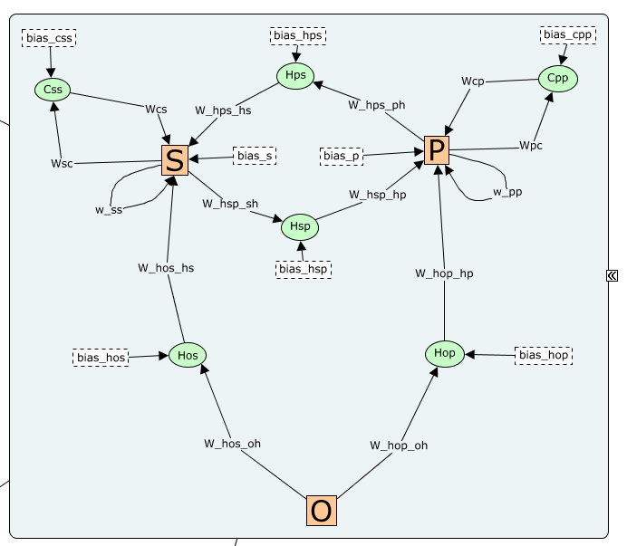

# Tensorflow word reading model

## Overview

This project implemented a variant of the Harm and Seidenberg (2004) triangle model on TensorFlow. We can run a model interactively on an Interactive Python Notebook (master.ipynb), it depends on a few custom low-level functions within the source code (src) folder (details in Code Modules section). You can find more details in the annotations or docstrings inside each file.

## Quick-start

1. Open master.ipynb.
1. Change the parameter in the “Parameters block”.
1. Run it.
1. Examine results in models/<code_name>/plots folder.

## Datasets

- All the data set is stored in the dataset folder
- Except for a few raw data files, all files inside this folder are generated by clean_data.ipynb
- `dataset`/`testsets` folder stores all the available test sets in a custom format, which is a dictionary containing these keys:
    - `item`: a list of lower case strings (str) that store the word form (e.g., dog, cat...).
    - `ort`:  a tf.Tensor object that stores the orthographic representation. The first dimension is the item dimension, the second dimension is the orthographic unit’s dimension (always = 119). For example, a test set that has 100 items will have a shape of (100, 119). 
    - `pho`: similar to ort, but for phonological representation. 
    - `sem`: similar to ort, but for semantic representation. Based on WordNet, obtained from Chang’s GitHub repo
    - `cond`: a list of strings that store the condition of a word (if condition exist in a testset)
    - `phoneme`: a list of 10 slots strings that store the vowel centered and padded phoneme in IPA? format. Based on Zevin’s source files.
- `mappingv2.txt`: a conversion table that stores how each phoneme is converted to phonological representation. Based on Jason Zevin’s files, except we removed some duplications.

## Modules

Module refers to a group of functionally related source codes located in the source code (src) folder. The module in the repo not listed below can either be deprecated or only useful on some special occasion. 

### meta.py

- Config: Defines a run setting, contains some metadata, and:
    - ModelConfig: model architecture and training related config
    - EnvironmentConfig (defined in training environment.py)
- Other support functions related to Config and GPU provisioning

### data_wrangling.py

- MyData: Defines the static (raw training) data set.
- Functions that help to create new test sets in a custom format.

### environment.py (training environment)
- EnvironmentConfig: Defines the configurations that related to Experience
- Experience: Contains different stages
    - Stage: Contains different tasks and their probability during training
        - Task: Contains the tasks and how the training corpus is opened to sampling

For example, creating simple reading stage triangle task only:
```python
task_names = ["triangle"]
tasks_ps = [1.0]
total_sample = 1_500_000
 
stages = [
    Stage(
        name="reading",
        tasks=[Task(x) for x in task_names],
        stage_sample=total_sample,
        task_probability_start=tasks_ps,
    )
]
 
experience = Experience(stages)
```

- Sampler: Control the training task and sample in each batch based on Experience. 

### modeling.py

- TriangleModel: Defines the triangle model architecture, the weight and biases are named as follow: 


- Inside MyModel, there are multiple tasks (e.g., task_triangle, task_ort_sem…). The model behaves differently depending on which task it is “on”. To switch task, calls .set_active_task() method. To avoid user error, there is no default task after .__init__(), you must call .set_active_task() at least once before using the model.
For the purpose of troubleshooting and understanding the internal information flow, calling the model (i.e., “model(input)”) not only returns the output layer of a given task. It will return a dictionary that contains pretty much everything, including the input arrays (see .INPUT_ARRAY_NAMES) and the activation array in each layer. 
training.py
There are 2 alternative functions for defining a single iteration of learning algorithm:
basic_train_step: somewhat standard single output loss training step. For all tasks except “triangle” (for tasks that involve targets at a single layer, e.g., pho OR sem)
triangle_train_step: multiple loss training steps, which will take “pho” and “sem” outputs to calculate their sum loss for later gradient decent
Trainer() defines the outer training loop. 
TensorBoardManager() manage how metrics/weights/losses is being write onto tensorboard.
metrics.py
It contains many custom metrics, all are compatible with TensorFlow metric (tf.keras.metrics.Metric) or losses (tf.keras.losses.Loss) format. See docstring for details. 
CustomBCE(): unlike the Tensoflow implementation, it supports the zero-error radius.
evaluate.py
Test: It is designed for testing (evaluating) the model after the model is trained. It can be used in isolation of training. Calling Test.eval(testset_name, task) will return the full evaluation results at all model checkpoints (saves). The results will automatically be stored in models/<run_name>/eval folder.
It will call metrics.py functions during the evaluation
Example use case snippet:

### benchmarks.py
- A set of “benchmark” experiments for testing and visualizing the model. Some of them are from HS04, some are new custom tests. See the docstrings for details. 

### examine.py
- A set of tools that visualize the internal temporal dynamics of a model. 
